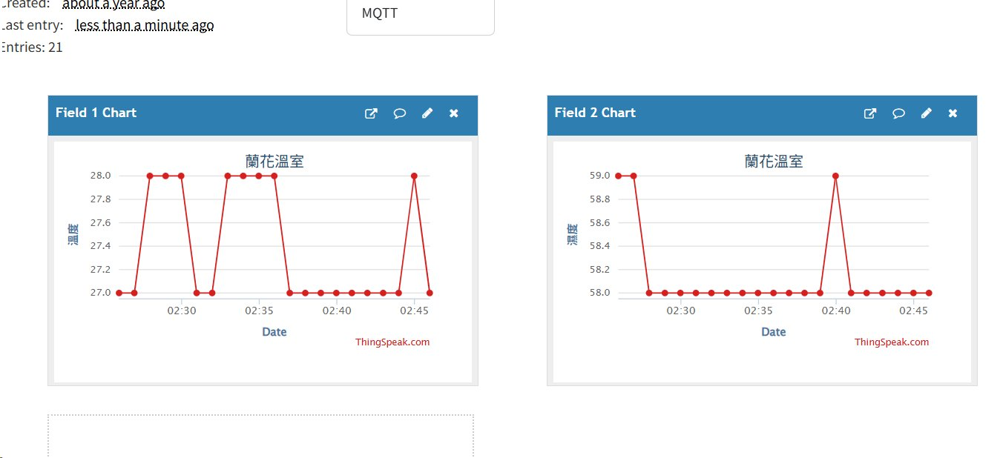

# ESP32 NB303 ThingSpeak MQTT 溫溼度上傳

本專案使用 ESP32 Arduino 程式，透過 NB303 NB-IoT 模組連線，讀取 DHT11 溫溼度資料，並以 MQTT 發送到 ThingSpeak。

## 硬體設定

- 開發板：ESP32
- NB-IoT 模組：NB303
- 感測器：DHT11
- DHT 程式庫：SimpleDHT
- DHT11 DATA 腳位：GPIO25
- NB303 UART：ESP32 Serial2，115200 8N1

## 接線

### ESP32 與 NB303

| ESP32 | NB303 |
| --- | --- |
| GPIO17 TX2 | RX |
| GPIO16 RX2 | TX |
| GPIO15 | 重開機控制腳 |
| GPIO33 | 重開機控制腳 |
| GND | GND |

GPIO15 與 GPIO33 會在 NB303 開機或重新註冊逾時時拉低 5 秒，再拉高，用來觸發 NB303 重開機。

### ESP32 與 DHT11

| ESP32 | DHT11 |
| --- | --- |
| GPIO25 | DATA |
| 3V3 | VCC |
| GND | GND |

## ThingSpeak MQTT 設定

請在 [src/esp32_nbiot_thingspeak_mqtt.ino](src/esp32_nbiot_thingspeak_mqtt.ino) 中填入自己的 ThingSpeak MQTT 資訊：

```cpp
String thingSpeakChannelId = "YOUR_CHANNEL_ID";
String thingSpeakMqttClientId = "YOUR_MQTT_CLIENT_ID";
String thingSpeakMqttUsername = "YOUR_MQTT_USERNAME";
String thingSpeakMqttPassword = "YOUR_MQTT_PASSWORD";
```

MQTT 連線設定：

- Domain：`mqtt3.thingspeak.com`
- NB303 EMQNEW Host/IP：`34.194.89.194`
- Port：`1883`
- Topic：`channels/<channelID>/publish`
- Payload：`field1=<temperature>&field2=<humidity>&status=NB303`
- Field 1：溫度
- Field 2：濕度

NB303 的 `AT+EMQNEW` 實測需使用 broker IP。若 ThingSpeak DNS 解析結果改變，請先用 `AT+EDNS="mqtt3.thingspeak.com"` 取得目前 IP，再更新程式中的 `thingSpeakHost`。

## ThingSpeak 資料取得方式

### 1. 取得 Channel ID

進入 ThingSpeak Channel 頁面後，頁面標題下方會顯示 `Channel ID`。請將該數值填入程式中的 `thingSpeakChannelId`。


```cpp
String thingSpeakChannelId = "YOUR_CHANNEL_ID";
```

### 2. 進入 MQTT Device 功能

ThingSpeak 上方選單選擇 `Devices`，再進入 `MQTT`。


### 3. 新增 MQTT Device 並授權 Channel

新增 MQTT Device 時，選擇要發送資料的 Channel，並勾選授權項目。


建議確認下列授權：

- Allow Publish
- Allow Subscribe

本專案主要使用 `Allow Publish` 將資料寫入 ThingSpeak Channel。

### 4. 取得 MQTT Credentials

完成 MQTT Device 建立後，ThingSpeak 會顯示 MQTT credentials。


請將欄位對應填入程式：

```cpp
String thingSpeakMqttClientId = "YOUR_MQTT_CLIENT_ID";
String thingSpeakMqttUsername = "YOUR_MQTT_USERNAME";
String thingSpeakMqttPassword = "YOUR_MQTT_PASSWORD";
```

ThingSpeak 不會保存可再次查看的 MQTT password。建立 MQTT Device 後，請立即保存或下載 credentials。

## 程式流程

1. ESP32 開機後，GPIO15 與 GPIO33 拉低 5 秒再拉高，觸發 NB303 重開機。
2. ESP32 送出 `ATI` 確認 NB303 回應正常。
3. `ATI` 成功後送出 `AT+SM=LOCK_FOREVER`，避免 NB303 進入睡眠。
4. 進入 `loop()` 後持續使用 `AT+CEREG?` 檢查網路註冊。
5. `+CEREG` 回應包含 `,1` 或 `,5` 時，視為已完成網路註冊。
6. 每次執行上傳任務前都會先確認已註冊，未註冊時不執行上傳。
7. 若 5 分鐘內仍未註冊，GPIO15 與 GPIO33 再次拉低 5 秒後拉高，重新啟動 NB303。
8. 註冊成功後立即上傳第一筆資料，之後每 1 分鐘上傳一次。

## 成果圖



## 常見問題

若序列監控出現下列訊息：

```text
[DHT11] read failed
```

請檢查 DHT11 的 VCC、GND、DATA 接線，並確認 DATA 已接到 GPIO25。
