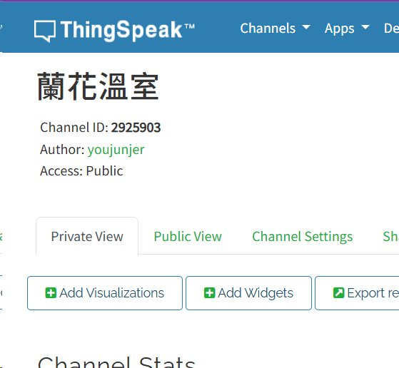
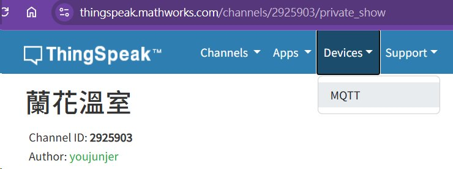
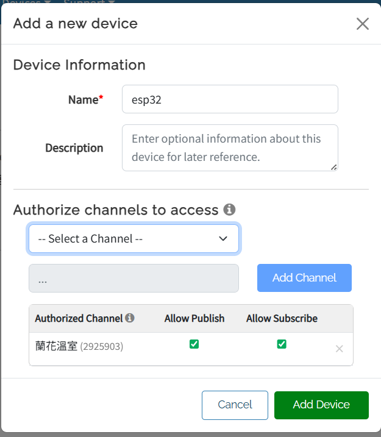
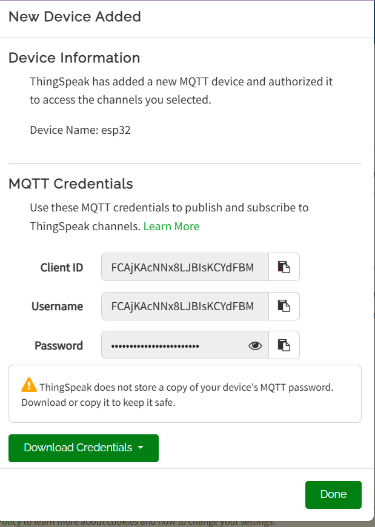

# ESP32 NB303 ThingSpeak 溫溼度 MQTT

本專案使用 ESP32 Arduino / PlatformIO 開發。ESP32 透過 NB303 NB-IoT 模組連線，讀取 DHT11 溫溼度，並透過 MQTT 發送至 ThingSpeak。

## 硬體

- 開發板：ESP32 NodeMCU-32S
- USB 序列監控：`COM11 @ 115200`
- NB303 UART：ESP32 `Serial2 @ 115200 8N1`
- 溫溼度感測器：`DHT11`
- DHT 程式庫：`SimpleDHT`

## 接線

### ESP32 與 NB303

| ESP32 | NB303 |
| --- | --- |
| GPIO17 TX2 | RX |
| GPIO16 RX2 | TX |
| GPIO15 | 重啟/控制腳 |
| GPIO33 | 重啟/控制腳 |
| GND | GND |

`GPIO15` 和 `GPIO33` 會拉低 5 秒後再拉高，用於觸發 NB303 重開機。

### ESP32 與 DHT11

| ESP32 | DHT11 |
| --- | --- |
| GPIO25 | DATA |
| 3V3 | VCC |
| GND | GND |

## ThingSpeak MQTT 設定

主要設定在 [src/esp32_nbiot_thingspeak_mqtt.ino](src/esp32_nbiot_thingspeak_mqtt.ino) 頂端：

```cpp
static const char *kThingSpeakHost = "mqtt3.thingspeak.com";
static const char *kThingSpeakPort = "1883";
static const char *kThingSpeakChannelId = "2925903";
static const char *kThingSpeakMqttClientId = "...";
static const char *kThingSpeakMqttUsername = "...";
static const char *kThingSpeakMqttPassword = "...";
```

### ThingSpeak 資料取得方式

1. 登入 ThingSpeak。
2. 建立或開啟要接收資料的 Channel。
3. 在 Channel 頁面找到 `Channel ID`，填入 `kThingSpeakChannelId`。
4. 從 ThingSpeak 上方選單進入 `Devices`，再選擇 `MQTT` 裝置設定頁面。
5. 新增 MQTT Device，並授權該裝置寫入指定 Channel。
6. ThingSpeak 會產生 MQTT credentials：
   - `Client ID` 填入 `kThingSpeakMqttClientId`
   - `Username` 填入 `kThingSpeakMqttUsername`
   - `Password` 填入 `kThingSpeakMqttPassword`
7. Channel 的 Field 設定建議：
   - Field 1：Temperature
   - Field 2：Humidity

### ThingSpeak 設定截圖說明

截圖存放於 `docs/images/`，檔名與用途如下。

#### 1. Channel ID



Channel 頁面顯示 `Channel ID`。本專案目前使用：

```cpp
static const char *kThingSpeakChannelId = "2925903";
```

#### 2. 新增 MQTT Device 並授權 Channel

從上方選單進入 `Devices`，並選擇 `MQTT`：



進入 MQTT 裝置頁面後，新增 MQTT Device 並授權 Channel：



新增 MQTT Device 時，需選擇授權 Channel，並勾選：

- Allow Publish
- Allow Subscribe

本專案至少需要 `Allow Publish` 權限，才能將資料寫入 ThingSpeak Channel。

#### 3. 複製 MQTT Credentials



建立 MQTT Device 後，ThingSpeak 會顯示下列 MQTT credentials：

- Client ID
- Username
- Password

上述三個值需填入程式：

```cpp
static const char *kThingSpeakMqttClientId = "...";
static const char *kThingSpeakMqttUsername = "...";
static const char *kThingSpeakMqttPassword = "...";
```

ThingSpeak 不會保存可再次查看的 MQTT password。建立 MQTT Device 後，需立即複製或下載保存。

MQTT 發送目標：

- Host：`mqtt3.thingspeak.com`
- Port：`1883`
- Topic：`channels/2925903/publish`
- Payload：`field1=<temperature>&field2=<humidity>&status=NB303`
- `field1`：溫度
- `field2`：濕度

## 執行流程

1. ESP32 觸發 NB303 重開機：`GPIO15`、`GPIO33` 拉低 5 秒後拉高。
2. ESP32 送 `ATI` 確認 NB303 正常回應。
3. `ATI` 正常後送 `AT+SM=LOCK_FOREVER`，避免 NB303 進入睡眠。
4. 執行任務前先送 `AT+CEREG?` 檢查註冊狀態。
5. `+CEREG` 回覆包含 `,1` 或 `,5` 才視為網路註冊完成。
6. 註冊完成後立即發送第 1 筆 ThingSpeak 資料。
7. 後續每 1 分鐘發送 1 筆資料。
8. 若重開機後 5 分鐘內仍未完成註冊，系統會再次觸發 NB303 重開機。

## 編譯

```powershell
python -m platformio run
```

## 上傳

```powershell
python -m platformio run -t upload
```

## 監控

```powershell
python -m platformio device monitor --port COM11 --baud 115200
```

## 注意事項

如果序列輸出出現：

```text
[DHT11] read failed
```

表示尚未成功讀取 DHT11。需檢查 `GPIO25`、VCC、GND、DATA 接線，以及 DHT11 DATA 腳是否需要上拉電阻。
